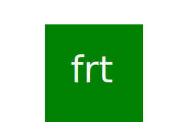

# SVG LogoMaker
[](https://opensource.org/licenses/MIT)

## Description

A command line application for generating a custom SVG logo

## Table of Contents

- [Description](#Description)
- [Installation](#Installation)
- [Usage](#Usage)
- [License](#License)
- [Contributing](#Contributing)
- [Tests](#Tests)
- [Technologies Used](#Technologies-Used)
- [Questions](#Questions)
- [Credits](#Credits)

## Installation

Clone the repository to your local machine and open in VS code (or other IDE/code editor). If you haven't already, install node.js. Open your terminal and run the command ```npm install``` to install the dependencies for this project. (Dependencies include Inquirer v8.2.4 and Jest v29.7.0).

## Usage

Check out the [walkthrough video](https://drive.google.com/file/d/1aSbpFrb3jA3AjBBau4kLJXkcL3gkCN_E/view) to see this application in action!

To use the application, open the project in VS code (or other IDE/code editor). Open your terminal and run the command ```node index.js``` You will be prompted to answer a series of questions about the logo that you are generating. It will ask for logo text (up to 3 characters), text color, shape of the logo, and background color. Here is an example:


The color prompts take either the color name (i.e. blue or pink) or the hexadecimal number as an input. Be careful to ensure that you are entering the color information in correctly. Once all of the questions are answered, a .svg logo file will be generated to the examples folder. 

 

Navigate to this folder in the repo and you will see the your logo with a unique file name structured "logo_TEXT_SHAPE.svg" 

Examples of logos you can generate with this program:

  


## License 

This project is available under the MIT license. See [LICENSE](./LICENSE) for more info.

## Contributing

This project is open to collaboration. If you want to contribute, fork the repo and open up an issue describing the intended contributions. Once complete, open a pull request and await for approval before merging.

## Tests

Unit testing for this project uses Jest. Run ```npm run test``` in the command line to run a unit test. There is currently one test suite running 3 tests for each Shape of logo being rendered { Triangle, Square, Circle }. It checks for the output of the ```render()``` and ```setColor()``` functions for each Shape.


## Technologies Used

JavaScript, Node.js, Inquirer v8.2.4, Jest v29.7.0

## Questions

If there are any questions, feel free to reachout to me on [GitHub](https://github.com/tavargas9), or send me an [email](mailto:tavargas9@gmail.com).

## Credits

This README was generated using [README Generator](https://github.com/tavargas9/README-generator) created by [Tomas Vargas](https://github.com/tavargas9).
